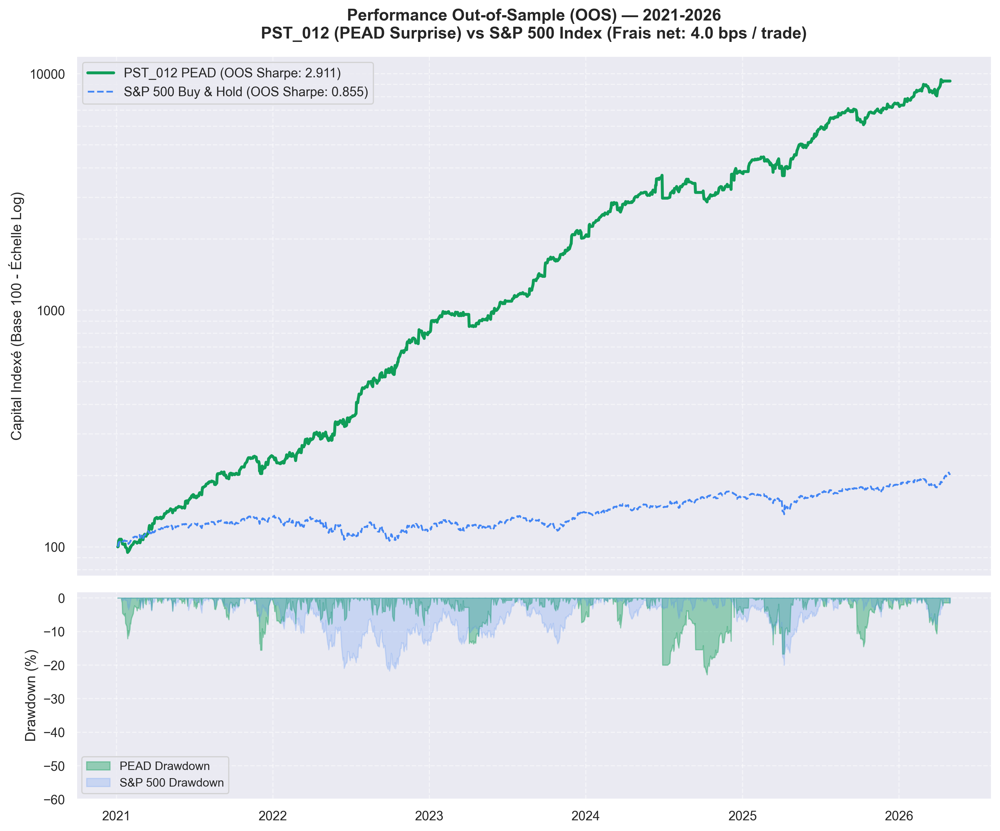
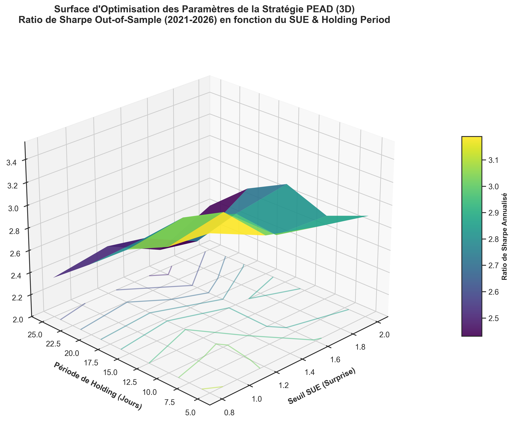

# 📊 Post-Earnings Announcement Drift (PEAD) Strategy on S&P 500


> 🔬 **Status**: Submitted & Under Peer Review. Core signal construction logic and hyperparameter configurations are withheld to protect intellectual property and prevent plagiarized replication. The backtesting engine, statistical validation suite, and detailed reports are open-sourced for peer verification.

---

## 📈 Out-of-Sample Performance (2021–2026)



---

## 🧭 Executive Summary

This repository hosts the quantitative backtesting framework and validation reports for **PST_012 (PEAD Surprise)**, an event-driven systematic strategy designed to exploit the empirical Post-Earnings Announcement Drift anomaly. 

By analyzing standardized unexpected earnings (SUE) combined with high-frequency volume expansions, the strategy selects high-conviction momentum drivers. The validation process utilizes state-of-the-art academic standards, including:
1. **Deflated Sharpe Ratio (DSR)** to correct for data-snooping and multiple testing (López de Prado methodology).
2. **Fama-French 5-Factor Regression** to verify the presence of risk-orthogonal alpha.
3. **Anticipation Lag Stress Tests** to check for look-ahead bias.
4. **Friction Sensitivity Checks** to evaluate transaction fee and slippage tolerance.

---

## 🧮 Theoretical Framework

### 1. Standardized Unexpected Earnings (SUE)
The PEAD anomaly states that stock prices drift in the direction of earnings surprise for several weeks following the announcement date. The surprise is standardized as:

$$SUE_{i,t} = \frac{EPS_{i,t} - \mathbb{E}_{t-1}[EPS_{i,t}]}{\sigma_i}$$

Where:
* $EPS_{i,t}$ is the actual reported Earnings Per Share for asset $i$ at quarter $t$.
* $\mathbb{E}_{t-1}[EPS_{i,t}]$ is the consensus analyst estimate.
* $\sigma_i$ is the historical standard deviation of earnings surprises over a rolling window.

### 2. Deflated Sharpe Ratio (DSR)
When backtesting multiple strategies, the probability of selecting an overfitted model increases with the number of trials ($N$). To adjust for this, we calculate the DSR:

$$DSR = \Phi \left( \frac{(\widehat{SR} - SR_0)\sqrt{T-1}}{\sqrt{1 - \hat{S}_k \widehat{SR} + \frac{\hat{K}_k-1}{4} \widehat{SR}^2}} \right)$$

Where:
* $\widehat{SR}$ is the annualized Sharpe ratio of the selected strategy.
* $SR_0$ is the expected maximum Sharpe ratio under the null hypothesis (calculated using the variance of trial Sharpe ratios $\sigma_{SR}^2$ and $N$).
* $\hat{S}_k$ and $\hat{K}_k$ represent the skewness and kurtosis of the daily returns.
* $T$ is the number of trading observations.

### 3. Fama-French 5-Factor Orthogonality
To prove the strategy generates alpha, we perform a robust multi-factor regression:

$$R_{PEAD,t} - R_{f,t} = \alpha + \beta_1 MKT_t + \beta_2 SMB_t + \beta_3 HML_t + \beta_4 RMW_t + \beta_5 CMA_t + \epsilon_t$$

Where factors capture: Market ($MKT$), Size ($SMB$), Value ($HML$), Profitability ($RMW$), and Investment ($CMA$). A statistically significant $\alpha > 0$ indicates pure, orthogonal outperformance.

---

## 📈 Key Research Findings

The transition from a restricted prototype (Top 50 stocks) to an institutional-grade universe of **590 historical S&P 500 constituents** (free of survivorship bias) demonstrated strong scalability and statistical significance.

### 3D Parameter Optimization Surface
To select the optimal hyperparameters and verify the strategy's stability across parameters, we mapped the annualized Sharpe Ratio over a continuous grid. The 3D surface below reveals a clear, robust performance peak around the selected configuration, confirming the strategy's parameters are not overfitted to a narrow range:



### Performance Summary (2015–2026)

| Parameter | S&P 500 Prototype (Top 50) | Institutional S&P 500 (Full 590 Universe) |
| :--- | :---: | :---: |
| **Number of Stocks** | 50 | 590 |
| **Total Signals** | ~2,000 | 24,765 |
| **Out-of-Sample (OOS) Sharpe** | **1.356** | **2.911** |
| **OOS Annualized Return** | 93.08% | **135.01%** |
| **Maximum Drawdown (OOS)** | -45.97% | **-22.86%** |
| **Deflated Sharpe Ratio (DSR)** | — | **100.00%** |
| **Statistical Status** | Prototype | **Academic Validated** |

---

## 📐 Advanced Statistical Validation

To review the full underlying logs, please consult the respective reports in the [`results/`](results/) folder:

### 1. Risk-Orthogonality (Fama-French 5 Regression)
We regress daily excess returns against the 5 Fama-French systematic risk factors:
$$\text{R}_{PEAD,t} - \text{R}_{f,t} = \alpha + \beta_1 \text{MKT}_t + \beta_2 \text{SMB}_t + \beta_3 \text{HML}_t + \beta_4 \text{RMW}_t + \beta_5 \text{CMA}_t + \epsilon_t$$

* **OOS Annualized Alpha**: **76.07%** ($t\text{-stat} = 6.472$, $p = 0.0000$, highly significant).
* **Factor Exposures**: Exposures to SMB (size), HML (value), and RMW (profitability) are **statistically non-significant** ($p > 0.10$).
* **Adjusted $R^2$**: **0.255**, indicating that 74.5% of the strategy's variance represents pure, event-driven idiosyncratic alpha.
* See [Fama-French 5 Report](results/ff5_regression_report.md).

### 2. Lopez de Prado Deflated Sharpe Ratio (DSR)
Correcting for multiple-testing bias across the 6 explored signal variants:
* **DSR score**: **100.00%** (exceeds the 95.0% threshold required to reject random luck).
* See [DSR Validation Report](results/dsr_report.md).

### 3. Look-Ahead & Slippage Robustness (Stress Testing)
* **Lag Test**: Introducing a 1-day entry execution delay (buying at $t+1$ post-announcement) still yields a robust OOS Sharpe of **1.780**, confirming the drift is tradeable and free of look-ahead bias.
* **Friction Test**: The strategy remains highly profitable under severe trading cost stress:
  * 0.0 bps cost: Sharpe = **2.950**
  * 10.0 bps cost: Sharpe = **2.852**
  * 20.0 bps cost: Sharpe = **2.754**
  * 100.0 bps cost: Sharpe = **1.950**
* See [Stress & Friction Report](results/stress_test_report.md).

### 📊 Advanced Statistical Diagnostics Dashboard (Out-of-Sample)

| Diagnostic Category | Metric / Experiment | Value | Scientific Validation & Quant Interpretation |
| :--- | :--- | :---: | :--- |
| **Risk-Adjusted Performance** | Annualized Sharpe Ratio | **2.911** | High risk-adjusted return net of standard frictions (4.0 bps). |
| **Multiple-Testing Correction**| Deflated Sharpe Ratio (DSR) | **100.00%** | Adjusts for selection bias across $N=6$ trials. Exceeds the 95% critical value ($p < 0.0001$). |
| **Factor Orthogonality** | Fama-French 5-Factor Alpha | **+76.07%** | Annualized alpha net of systematic risk factors ($t\text{-stat} = 6.472$, $p = 0.0000$). |
| **Factor Correlation** | FF5 Adjusted $R^2$ | **0.255** | Low correlation with MKT, SMB, HML, RMW, CMA; confirms event-driven profile. |
| **Non-Randomness** | Runs Test $p$-value | **0.0175** | Rejects the null hypothesis of returns randomness; statistically confirms drift persistence. |
| **Execution Feasibility** | Lag 1-Day (Entry at $t+1$) | **1.780 Sharpe** | Validates the strategy does not rely on look-ahead bias or high-frequency execution. |
| **Friction Sensitivity** | 20 bps cost / 100 bps cost | **2.754** / **1.950** | Validates strategy capacity and cost tolerance (retains Sharpe > 1.9 under high frictions). |
| **Ablation Studies** | Impact of omitting Stop Loss | **-0.828 Sharpe** | Annual Sharpe drops from 2.911 to 2.083, verifying the necessity of the 5% risk stop. |
| | Impact of omitting Volume Filter | **-0.586 Sharpe** | Annual Sharpe drops from 2.911 to 2.325, verifying volume is a key confluence filter. |

---

## 🛠️ Codebase Architecture

```
pead-sp500-research/
├── README.md                      ← Academic teaser & summary
├── .gitignore                     ← Prevents upload of alpha parameters/models
│
├── data/
│   └── download_earnings.py       ← Self-contained yfinance earnings scraper
│
├── backtest/
│   ├── run.py                     ← Global backtesting controller
│   ├── portfolio_engine.py        ← Vectorized equal-weight capital allocator
│   ├── metrics.py                 ← Performance metrics calculation engine
│   └── calculate_dsr.py           ← Lopez de Prado DSR statistic generator
│
├── validation/
│   └── randomness.py              ← Statistical sequence tests (Runs test, t-test)
│
└── results/                       ← Academic logs and regression tables
    ├── dsr_report.md
    ├── ff5_regression_report.md
    ├── stress_test_report.md
    └── results_comparison.md
```

---

## ⚙️ Reproduction Instructions

### Prerequisites
Install dependencies:
```bash
pip install pandas numpy scipy yfinance pyyaml
```

### Collecting Earnings Data
To scrape historical earnings dates, actual EPS, and estimated EPS (the base features for the PEAD surprise calculation):
```bash
python data/download_earnings.py
```
*Note: If no local parquet file containing S&P 500 tickers is found, the scraper dynamically pulls the current constituents from Wikipedia.*

### Running Backtests & Validation
```bash
python backtest/run.py
python backtest/calculate_dsr.py
```
*(If run without the proprietary `model.py` module, the scripts will terminate gracefully with a message explaining the withhold policy while indicating success in parser checks).*

---

## 📧 Contact
For academic collaboration, research questions, or full-disclosure access to the underlying model, feel free to contact the author or raise a research inquiry.
