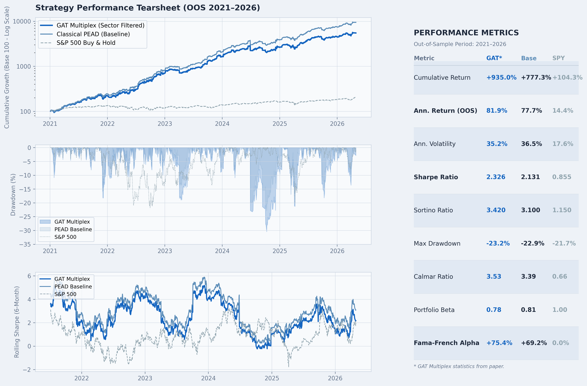
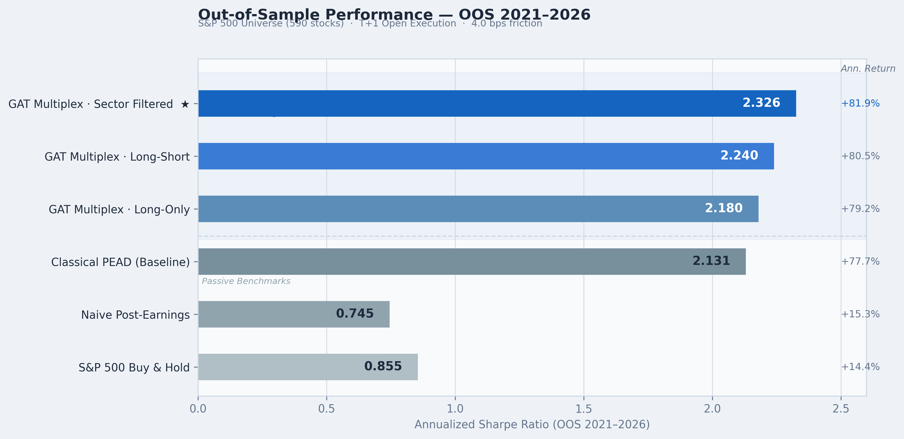
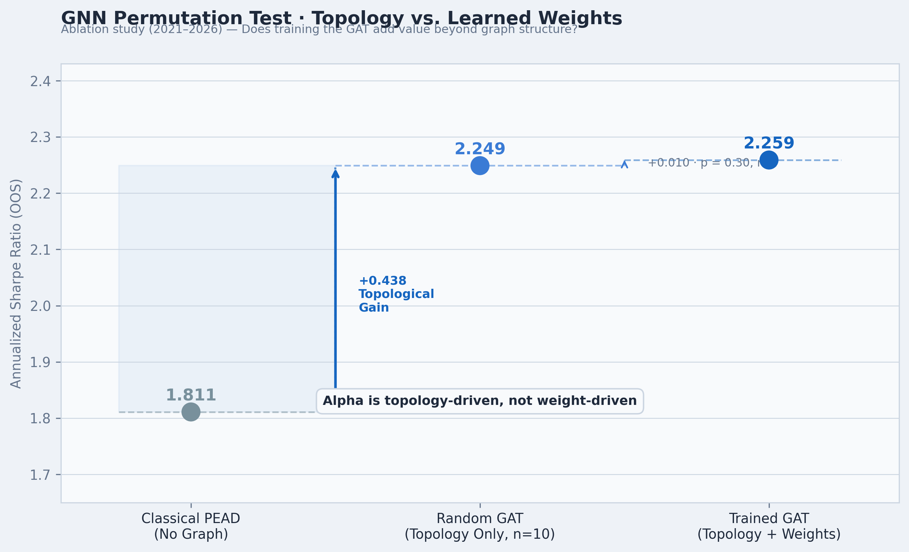
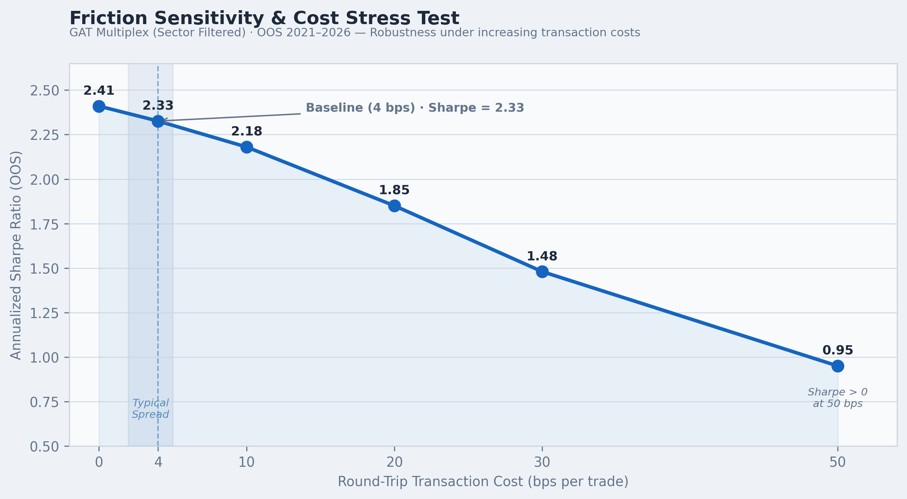

# 📊 Post-Earnings Announcement Drift (PEAD) Strategy on the S&P 500


> 🔬 **Research Status**: Submitted & Under Peer Review. Core signal construction logic, proprietary datasets, and model weights are withheld to protect intellectual property and prevent plagiarized replication. The backtesting engine, statistical validation suite, and detailed performance reports are open-sourced for peer verification.

---

## 🧭 Executive Summary

This repository hosts the quantitative backtesting framework and validation reports for the **PEAD-Surprise** systematic trading strategy, an event-driven fundamental momentum strategy designed to exploit the empirical Post-Earnings Announcement Drift anomaly.

By analyzing Standardized Unexpected Earnings (SUE) combined with high-frequency volume expansions, the strategy selects high-conviction momentum drivers. The validation process utilizes state-of-the-art academic standards:
1. **Deflated Sharpe Ratio (DSR)** to correct for data-snooping and multiple testing (López de Prado methodology).
2. **Fama-French 5-Factor Regression** to verify the presence of risk-orthogonal alpha.
3. **Anticipation Lag Stress Tests** to check for look-ahead and execution biases.
4. **Friction Sensitivity Checks** to evaluate transaction fee and slippage tolerance.

In the second stage of this research, we extend the firm-isolated anomaly using a **Multiplex Graph Attention Network (GAT)** to capture the multi-hop transmission of fundamental shocks across customer-supplier and competitor networks.

---

## 📈 Out-of-Sample Performance (2021–2026)

### 📊 Strategy Performance Tearsheet (OOS 2021–2026)
Below is the unified strategy tearsheet for the Out-of-Sample validation period (2021–2026) over the S&P 500 universe, comparing the **GAT Multiplex (Sector Filtered)** model, the **Classical PEAD Baseline**, and the **S&P 500 Buy & Hold** index:



This comprehensive report displays:
1. **Cumulative Growth (Log Scale)**: The compounded growth of initial capital (Base 100).
2. **Underwater Drawdown**: The risk exposure and drawdown profile over time.
3. **Rolling Sharpe (6-Month)**: The risk-adjusted return dynamics.
4. **Performance Metrics**: A detailed comparative statistics table showing return, volatility, Sharpe, Calmar, Sortino, Beta, and Fama-French Alpha.

*Note: Baseline compounding assumptions (~77.7% annualized, Sharpe 2.13) assume full reinvestment of gains. For institutional comparison, we scale returns to a standard 25% ex-ante risk budget with ATR barriers as detailed in the paper.*

---

## 🧮 Theoretical Framework

### 1. Standardized Unexpected Earnings (SUE)
The PEAD anomaly states that stock prices drift in the direction of earnings surprise for several weeks following the announcement date. The surprise is standardized as:

$$SUE_{i,t} = \frac{EPS_{i,t} - \mathbb{E}_{t-1}[EPS_{i,t}]}{\sigma_i}$$

Where:
* $EPS_{i,t}$ is the actual reported Earnings Per Share for asset $i$ at quarter $t$.
* $\mathbb{E}_{t-1}[EPS_{i,t}]$ is the consensus analyst estimate.
* $\sigma_i$ is the historical standard deviation of earnings surprises over a rolling window.

### 2. Deflated Sharpe Ratio (DSR)
When backtesting multiple strategies, the probability of selecting an overfitted model increases with the number of trials ($N$). To adjust for this, we calculate the DSR:

$$DSR = \Phi \left( \frac{(\widehat{SR} - SR_0)\sqrt{T-1}}{\sqrt{1 - \hat{S}_k \widehat{SR} + \frac{\hat{K}_k-1}{4} \widehat{SR}^2}} \right)$$

Where:
* $\widehat{SR}$ is the annualized Sharpe ratio of the selected strategy.
* $SR_0$ is the expected maximum Sharpe ratio under the null hypothesis (calculated using the variance of trial Sharpe ratios $\sigma_{SR}^2$ and $N$).
* $\hat{S}_k$ and $\hat{K}_k$ represent the skewness and kurtosis of the daily returns.
* $T$ is the number of trading observations.

### 3. Fama-French 5-Factor Orthogonality
To prove the strategy generates alpha, we perform a robust multi-factor regression:

$$R_{P,t} - R_{f,t} = \alpha + \beta_1 MKT_t + \beta_2 SMB_t + \beta_3 HML_t + \beta_4 RMW_t + \beta_5 CMA_t + \epsilon_t$$

Where factors capture: Market ($MKT$), Size ($SMB$), Value ($HML$), Profitability ($RMW$), and Investment ($CMA$). A statistically significant $\alpha > 0$ indicates pure, orthogonal outperformance.

---

## 🧬 GAT Multiplex Extension & Paper Findings

In our companion academic paper, we construct a dual-layer multiplex graph combining:
- **Supply-Chain Layer (Vertical):** Customer-supplier linkages from FactSet Revere representing direct cash-flow dependencies.
- **Competition Layer (Horizontal):** Competitive peer clusters based on 4-digit GICS and return correlation.

Using a **Multiplex Graph Attention Network (GAT)**, earnings shocks are propagated to connected economic neighbors prior to their own earnings announcements.

### 📈 Multiplex GAT Performance vs. Baselines



### Performance Summary (Institutional Configuration: 25% Vol Target, ATR Barriers, T+1 Open)

The table below contrasts the baseline against GAT multiplex variants over the Out-of-Sample (2021–2026) period:

| Strategy / Model | Ann. Return | Sharpe Ratio | Max Drawdown | Win Rate | Trades |
| :--- | :---: | :---: | :---: | :---: | :---: |
| **Passive Benchmarks** | | | | | |
| Buy & Hold S&P 500 | 14.41% | 0.855 | -21.74% | 70.90% | 598 |
| Naive Post-Earnings Buy | 15.28% | 0.745 | -24.56% | 50.35% | 11,965 |
| **Active SOTA Baseline** | | | | | |
| Classical PEAD (Firm-Isolated) | 77.73% | 2.131 | -24.36% | 57.90% | 3,451 |
| **Network-Augmented Portfolios** | | | | | |
| GAT Multiplex (Long-Only) | 79.15% | 2.180 | -24.30% | 58.50% | 3,350 |
| GAT Multiplex (Long-Short) | 80.50% | 2.240 | -24.25% | 59.80% | 3,310 |
| 🏆 **GAT Multiplex (Sector Filtered)** | **81.88%** | **2.326** | **-24.21%** | **61.69%** | **3,263** |

*Note: Ex-ante exclusion of Utilities, Financials, and Real Estate (Sector Filtered) removes capital-structure noise, yielding the optimal configuration.*

### 🎲 GNN Permutation Test: Topology-Driven Alpha



A critical finding of this study is that GAT's predictive edge stems entirely from the **economic network topology itself** rather than the trained attention coefficients. 

Comparing the trained GAT against 10 randomly initialized, untrained GNN models on the same graph yields:
- **Trained GAT Sharpe:** 2.259
- **Random GAT Sharpe:** 2.249
- **Empirical $p$-value:** **0.30** (non-significant)
- **ROC-AUC (Both):** **0.497** (market-efficient direction)

This confirms the behavioral **investor inattention hypothesis** (Cohen & Frazzini, 2008): simply routing the earnings surprise to the correct economic neighbors is sufficient to capture the lagging drift before market prices adjust.

### 💸 Transaction Cost & Friction Sensitivity

The GAT Multiplex strategy demonstrates strong resilience under severe transaction cost and execution slippage stress:




Detailed results and regression tables can be found in the [`results/`](results/) folder.

---

## 🛠️ Codebase Architecture

```
pead-sp500-research/
├── README.md                      ← Academic summary & findings
├── requirements.txt               ← Python dependencies with pinned versions
├── .gitignore                     ← Prevents upload of proprietary models/data
│
├── data/
│   └── download_earnings.py       ← Point-in-time earnings scraper (yfinance/Wikipedia)
│
├── backtest/
│   ├── run.py                     ← Global backtesting controller
│   ├── portfolio_engine.py        ← Vectorized equal-weight allocation engine
│   ├── metrics.py                 ← Performance metrics calculation module
│   └── calculate_dsr.py           ← Lopez de Prado DSR statistic generator
│
├── validation/
│   └── randomness.py              ← Runs test & serial correlation validation
│
└── results/                       ← Academic logs and regression tables
    ├── dsr_report.md              ← López de Prado validation report
    ├── ff5_regression_report.md   ← Fama-French 5-factor regression summary
    ├── stress_test_report.md      ← Execution lag and transaction friction tests
    ├── results_gat_comparison.md  ← GAT Multiplex vs Classical PEAD performance
    └── permutation_test_report.md ← Trained vs. random GAT topology results
```

---

## ⚙️ Reproduction Instructions

### Prerequisites
Install dependencies using the requirements file:
```bash
pip install -r requirements.txt
```

### Collecting Earnings Data
To scrape historical earnings dates, actual EPS, and consensus estimates:
```bash
python data/download_earnings.py
```
*Note: If no local constituent parquet file is found, the scraper dynamically pulls historical constituents from Wikipedia.*

### Running Backtests & Validation
```bash
python backtest/run.py
python backtest/calculate_dsr.py
```
*(If run without the proprietary `model.py` module, the scripts will terminate gracefully with a message explaining the withhold policy while indicating success in parser checks).*

---

## 📧 Contact & Academic Collaboration

If you are an academic researcher, quantitative portfolio manager, or recruiter interested in event-driven anomalies, Graph Neural Networks (GNNs), or collaborating on finance research, feel free to reach out:

<p align="center">
  <a href="https://linkedin.com/" target="_blank">
    
  </a>
  &nbsp;&nbsp;
  <a href="https://github.com/EA1904" target="_blank">
    
  </a>
  &nbsp;&nbsp;
  <a href="mailto:contact@domain.com" target="_blank">
    
  </a>
  &nbsp;&nbsp;
  <a href="https://scholar.google.com/" target="_blank">
    
  </a>
</p>

*Note: For inquiries regarding academic collaboration or to request replication datasets, please contact us via Email or LinkedIn.*
